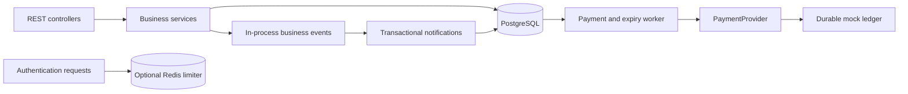
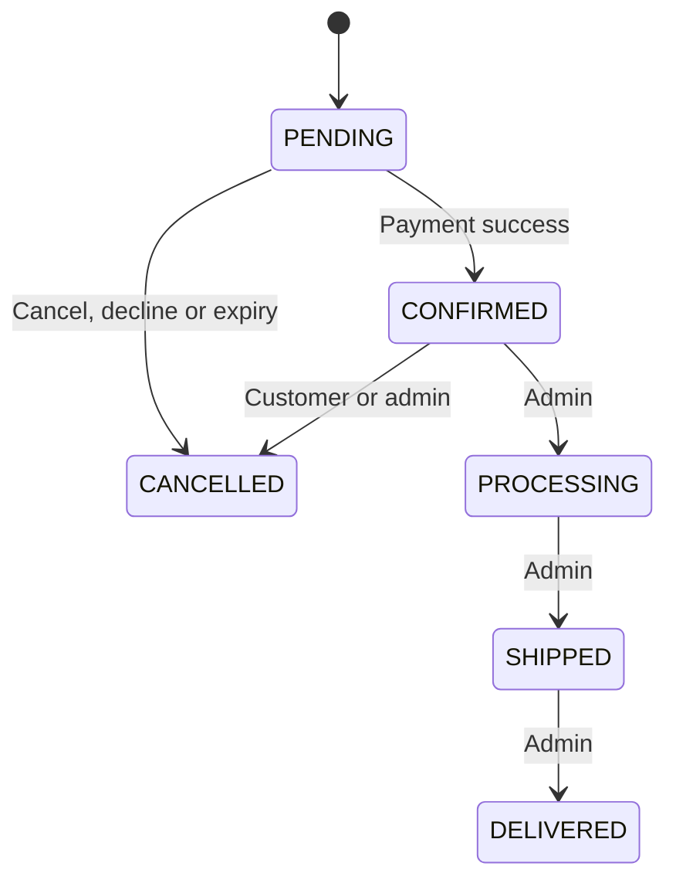

# Order Management Platform

The React frontend lives in [orderflow_ui](orderflow_ui/README.md). It includes the storefront, customer account, admin, inventory and reporting workspaces. Frontend payment integration and checkout submission are intentionally on hold; the existing backend mock payment implementation remains available for backend testing.

A Java 25 / Spring Boot 3.5 modular monolith for a realistic commerce workload. It manages customers, a product catalog, inventory, carts, checkout, coupons, mock payments, order fulfilment, notifications, and operational reports.

This is a backend portfolio project for Cloud / DevOps / SRE work. It includes application health probes, external configuration, structured logs, a Dockerfile, and meaningful concurrency tests. **AWS infrastructure, Terraform, Kubernetes, and CI/CD are not implemented.**

## Business problem

Checkout must stay correct when customers compete for the last item, retry a request after losing a response, or encounter a payment timeout. This application treats these as ordinary workflows:

- Stock reservation and order creation commit together.
- A repeated checkout key returns the original result.
- Successful payment consumes reserved stock.
- Failed payment cancels the order and releases stock.
- Unresolved payment retries until reservation expiry, then cancellation queues a void/refund.
- Cancellation and delayed payment processing cannot cause a second charge or duplicate restock.

## Technology and modules

Java 25, Maven, Spring Boot 3.x, Spring MVC, Spring Data JPA, PostgreSQL, Flyway, Bean Validation, Spring Security OAuth2 Resource Server/JWT, BCrypt, Spring Data Redis, Actuator, springdoc OpenAPI, JUnit 5, Mockito, and Testcontainers. No AWS SDK or microservice framework.

| Module | Responsibility |
| --- | --- |
| authentication | Registration, login, signed JWTs, current account checks, optional distributed rate limit |
| customer | Profiles, owned addresses, activation, admin customer list |
| product | Categories, catalog search/filter/page/sort, soft deactivation |
| inventory | Row-locked stock changes and append-only audit history |
| cart | One cart per customer, quantity validation and live price estimates |
| order | Checkout, price snapshots, state machine, status history, idempotency |
| discount | Percentage/fixed coupons, eligibility, expiry and atomic usage limits |
| payment | Provider contract, durable mock provider, retry and refund processing |
| notification | Transactionally stored business notifications and customer inbox |
| reporting | Revenue, status counts, top products, low stock, failed payments and cancellations |
| common | Error responses, request correlation, OpenAPI configuration |

Controllers validate transport inputs and delegate to services. Services own business rules and transaction boundaries. Repositories own persistence. Cross-module calls remain in-process; UUID references keep aggregates small and avoid implicit lazy-loading dependencies.

See [architecture and trade-offs](docs/architecture.md), [API guide](docs/api.md), and [verification record](docs/verification.md).

## Architecture



The provider call occurs **outside** the order transaction. A local transaction cannot roll back a remote charge. Instead, durable payment work and provider idempotency allow recovery after a crash between charge and settlement.

## Business workflows

### Checkout

1. Authenticate an active customer; lock that customer's row.
2. Validate the idempotency key and request fingerprint.
3. Replay an existing response, or validate the cart and owned shipping address.
4. Lock products in ascending database UUID order; validate activity and snapshot their prices.
5. Lock and redeem the coupon, if supplied.
6. Calculate discount, tax on the discounted subtotal, and final total using `BigDecimal`.
7. Create the pending order, reserve stock, record stock/status history, create notifications and payment work, store the response, and clear the cart in one transaction.
8. A background worker processes payment. Poll the order/payment endpoints for the final result.

Any database/business failure before commit rolls back the entire checkout, including coupon usage, reservations, cart clearing, notifications, and the idempotency record.

### Order lifecycle



Only payment settlement can confirm an order. Admin fulfilment cannot bypass payment. Repeated cancellation is harmless. Processing, shipped, and delivered orders cannot be cancelled in this model.

### Pricing and coupons

- Currency: INR, two decimal places; rounding: HALF_UP.
- Tax rate defaults to 0.18 and is configurable as a fraction from 0 to 1, with up to six decimal places.
- Tax applies after discounts. For ₹1,000 less 10%, tax is ₹162 and total is ₹1,062.
- Fixed discounts never exceed subtotal. Percentage discounts can have a maximum amount.
- Coupons support expiration, minimum amount, global/per-customer limits, and optional individual customer eligibility.
- A redemption remains counted after cancellation. This deliberate policy avoids recycling limited coupons through cancellation.
- Cart prices are current estimates. Checkout snapshots prices, names, SKUs, address, currency, tax rate, and totals. Later catalog/profile edits do not alter historical orders.

## Database

Flyway migrations create the schema; Hibernate uses `ddl-auto=validate`.

| Migration | Contents |
| --- | --- |
| V1 | customers, addresses, categories, products |
| V2 | inventory, inventory_transactions, carts, cart_items |
| V3 | orders, order_items, order_status_history, coupons, coupon_usage |
| V4 | payments, mock_provider_ledger, idempotency_records, notifications |

Database checks prevent negative stock/money, invalid statuses, invalid coupon usage, and inconsistent order totals. Foreign keys preserve history. Unique constraints enforce email, SKU, one cart/customer, one payment/order, coupon/order usage, and customer/idempotency-key uniqueness.

Important indexes and their query purposes are explained in [database design](docs/architecture.md#database-and-indexes). No hard deletion of historical products or customers is exposed.

## Local setup

Prerequisites: JDK 25, Maven 3.9+, PostgreSQL 17. Docker is optional for running the app locally, but required by the default Testcontainers test path. Redis is optional.

The application sets the JVM default timezone to UTC before Spring starts, matching Hibernate's UTC configuration. This also ensures Flyway's initial PostgreSQL connection does not inherit an unsupported host timezone alias such as `Asia/Calcutta`. Application logs and operations using the default timezone consequently use UTC.

### PowerShell configuration

Set your own values; the application does not provide default database credentials or a default JWT signing secret.

```powershell
$env:DB_URL = 'jdbc:postgresql://localhost:5432/orders'
$env:DB_USERNAME = 'your_database_user'
$env:DB_PASSWORD = Read-Host 'Database password' -MaskInput
$env:JWT_SECRET = [Convert]::ToBase64String([System.Security.Cryptography.RandomNumberGenerator]::GetBytes(48))
$env:SPRING_PROFILES_ACTIVE = 'dev'
$env:REDIS_ENABLED = 'false'
mvn spring-boot:run
```

Create the `orders` database first. Alternatively set the environment variables and start local dependencies:

```shell
docker compose up -d postgres redis
```

Compose uses the variables from your environment or an uncommitted `.env` file. Copy `.env.example` and fill in its blank values. **Spring Boot does not automatically read a .env file**; export the variables when running outside Compose.

Open [Swagger UI](http://localhost:8080/swagger-ui.html). Use the returned JWT with Swagger's **Authorize** button. API descriptions: [OpenAPI JSON](http://localhost:8080/v3/api-docs).

### First administrator / inventory manager

Registration always creates a CUSTOMER. There is no public role-selection or bootstrap-password endpoint.

Register your account, then use a trusted database session to grant an operational role:

```sql
-- Substitute the email of the account you intentionally registered.
UPDATE customers SET role = 'ADMIN', version = version + 1, updated_at = now()
WHERE email = 'your-admin-email@example.com';

-- An inventory operator can instead receive INVENTORY_MANAGER.
```

Role changes and deactivation take effect on the next authenticated request, even for already-issued JWTs. All elevated API operations enforce roles. A production identity/bootstrap procedure is future work.

## Environment variables

| Variable | Purpose / default |
| --- | --- |
| DB_URL | Required PostgreSQL JDBC URL |
| DB_USERNAME / DB_PASSWORD | Required database credentials |
| JWT_SECRET | Required signing secret, at least 32 UTF-8 bytes; generate cryptographically |
| SPRING_PROFILES_ACTIVE | `dev`, `test`, or `prod`; choose explicitly |
| DB_POOL_SIZE | Maximum DB connections, default 10 |
| TAX_RATE | Fractional tax rate, default 0.18 |
| REDIS_ENABLED | Distributed authentication limiter, default false |
| REDIS_HOST / REDIS_PORT | Redis connection, localhost / 6379 |
| REDIS_PASSWORD | Optional Redis authentication |
| SERVER_PORT | Standard Spring Boot setting, default 8080 |
| APP_PAYMENT_RESERVATION_TTL | Standard binding override, default PT15M |
| APP_PAYMENT_POLL_MS | Default 3000 |
| JAVA_TOOL_OPTIONS | Optional JVM tuning in the container |

JWT issuer defaults to `order-platform`; token lifetime is 30 minutes. Keep the signing secret stable across instances and restarts. No refresh token, individual token revocation, or automatic key rotation is implemented.

The `prod` profile disables Swagger/OpenAPI exposure. Configuration is external; the profile does not contain credentials or environment-specific URLs.

## Running tests

```shell
mvn test
mvn verify
```

`test` runs fast unit tests. `verify` additionally runs PostgreSQL integration tests with Testcontainers. Docker must be running; absence of Docker is a failure, not a silently skipped database test.

To run the same integration suite against an existing **dedicated test PostgreSQL instance**:

```powershell
$env:TEST_DB_URL = 'jdbc:postgresql://localhost:5432/your_test_database'
$env:TEST_DB_USERNAME = 'your_test_user'
$env:TEST_DB_PASSWORD = Read-Host 'Test database password' -MaskInput
mvn verify
```

Each run creates a random isolated schema and truncates only its own application tables between tests. The test user must have CREATE SCHEMA permission. Schemas are retained for failure diagnosis; remove only obsolete `test_...` schemas in the dedicated test database when no tests are running.

Tests exercise the full HTTP/security/service/JPA/PostgreSQL path, migrations/schema validation, last-unit contention, concurrent duplicate requests, coupon-limit contention, provider deduplication, payment decline/timeout, cancellation races, crash recovery, historical pricing, transactional rollback, reports, and health/OpenAPI.

See [verification record](docs/verification.md) for what was actually executed in this workspace.

## Running with Docker

```shell
docker build -t order-platform:local .
docker compose --profile app up --build
```

The image uses a Maven/JDK 25 build stage and a non-root JRE 25 runtime. Supply the required environment variables. The Compose file is a local development convenience, not production infrastructure. It binds exposed ports to loopback and persists local database/Redis data.

The Dockerfile skips tests while packaging; run `mvn verify` before building the image. It has no embedded database credentials or JWT secret. Image digest pinning and vulnerability scanning belong in your future release process.

## API examples

[docs/requests.http](docs/requests.http) provides a reusable sequence for a REST client, with variables for passwords, JWTs, and generated resource IDs.

Typical checkout:

```http
POST /api/orders
Authorization: Bearer <customer-jwt>
Content-Type: application/json
Idempotency-Key: checkout-unique-key

{
  "addressId": "<owned-address-uuid>",
  "couponCode": "ORDER10",
  "paymentScenario": "SUCCESS"
}
```

The first response is **201 Created**, with a PENDING order and Location header. A replay with the same key and body returns **200 OK**, `Idempotency-Replayed: true`, and the original response. Reusing the key for a different address/coupon/scenario returns **409 Conflict**. Keys are scoped to a customer and retained without automatic expiry.

Use `GET /api/orders/{id}` for current status. Cart mutations after checkout do not change the meaning of an existing key. Omitting the optional coupon is supported; an empty coupon string is not a valid HTTP input.

## Redis rationale

Redis implements a shared, atomic fixed-window limiter: 20 login/registration attempts per source IP per 60 seconds. A Lua script combines increment and expiry, so a crash cannot leave a permanent counter.

This is a genuine cross-instance application benefit. PostgreSQL remains the source of truth for money, inventory, and idempotency. Redis is disabled by default for a minimal local setup.

When enabled, a Redis outage returns **503** on authentication and makes readiness unhealthy. Other application operations can continue. The limiter uses the actual peer address and does not trust arbitrary forwarded headers. Behind a load balancer, configure a trusted proxy boundary before changing source-IP handling; otherwise clients share the proxy's quota. Shared NATs also share a quota.

## Observability

- JSON logs contain generated requestId and, where available, customerId, orderId, paymentId.
- No request bodies, passwords, authorization headers, signing keys, or payment details are logged.
- Order-transition logs and counters run after commit.
- Standard HTTP/JVM/database metrics and the `orders.transitions` Micrometer counter are registered. Only health/info endpoints are exposed by default.
- `/actuator/health/liveness`: process health, independent of downstream availability.
- `/actuator/health/readiness`: application readiness, PostgreSQL, and Redis when enabled.
- Graceful shutdown is enabled. Payment state survives restarts.

Logs and metrics are operational signals, not the accounting ledger. PostgreSQL order/payment/audit records are authoritative.

## Known limitations

- Payments are simulated, including in the prod profile. Never use this application to collect real payment details.
- Single currency and a single configurable tax rate; no jurisdictional tax engine, shipping fees, returns, partial fulfilment, or partial refunds.
- Notifications are stored in a customer inbox. There is no external email/broker delivery yet.
- Payment polling is at-least-once. Multiple replicas may perform redundant provider calls; durable provider idempotency prevents duplicate charges. Add database work claims/leases when throughput justifies them.
- Provider outages keep work pending and retryable. Refund work has no automatic abandonment; production alerting must identify old pending/refund rows.
- Idempotency and audit records need a deliberate long-term retention policy.
- Catalog substring search is intentionally simple; no full-text/search service.
- Entity-shaped read responses expose record IDs/timestamps/version fields. Request DTOs are explicit, and customer password hashes are never returned. A separately versioned public response contract is a future evolution.
- No password reset, email verification, MFA, refresh tokens, or per-token logout. Deactivating an account invalidates access immediately.
- The optional Redis limiter is unit tested; live Redis behavior and the Docker image must also be validated in an environment with Docker.
- No load test, penetration test, backup/restore drill, or availability guarantee is claimed.

## Future Production Architecture

This section is a deployment roadmap, **not implemented infrastructure**.

The application can later run in ECS/Fargate behind an ALB, with RDS PostgreSQL, managed Redis, Secrets Manager, least-privilege IAM, CloudWatch and OpenTelemetry. Add Terraform for VPC/subnets/security groups, WAF, Route 53, CI/CD, controlled migrations, autoscaling, load testing, disaster recovery and cost controls. S3/CloudFront become relevant if a frontend or product media is added.

Preserve the transactional boundaries and provider idempotency contract during deployment. Add an outbox delivery adapter for SQS/SNS/SES/Kafka before sending real external notifications. Keep liveness independent from database outages, and size database pools against replica count and RDS capacity.

